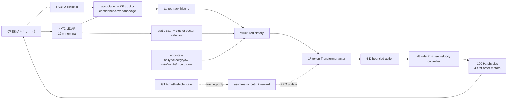

# MOTAR 시스템 사양서 — 2026-08-24

이 문서는 발표·논문·사이트에서 공통으로 사용하는 시스템 사양이다. 2026-08-27 이후의
**corrected non-overlap physical v2**와 그 이전 historical `navrl_band` 결과를 반드시 분리한다. 숫자는
설정값 또는 시뮬레이터 내부 계산값이며, `MEASURED`라고 표시하지 않은 하드웨어 값은 실제 기체
식별값이 아니다.

## 1. 현재 상태와 주장 범위

| 항목 | 현재 판정 |
|---|---|
| 시뮬레이션 계약/계측 | 2026-08-27 full regression 834 tests PASS, 2 intentional skips |
| software-only sim-to-real preflight | 구조 PASS, `SYNTHETIC_ONLY` |
| physical target Track B | recovery-v2 32/32 integrity PASS, `FAIL_ROUTE_MECHANISM`; no-anchor follow-up `INCONCLUSIVE`; 종료 |
| mode probe | `INCONCLUSIVE_POLICY_CHIRALITY`; 개선 근거로 채택하지 않음 |
| corrected non-overlap route gate r2 | 32/32 integrity PASS, `FAIL_ROUTE_MECHANISM`; 70-bar plan 17.78%, fallback 30.02%, 0.6 goals/env 0.21875 |
| corrected non-overlap fresh PPO | `NOT RUN` (0 epoch); route gate 실패로 500-epoch smoke와 장기학습 모두 미실행 |
| 실제 기체/센서 로그 | 미조립·0회 비행·0개 실측 로그 |

따라서 현재 논문에서 주장할 수 있는 것은 **재현 가능한 시뮬레이션 failure analysis**까지다.
sim-to-real 성능이나 실제 비행 가능성을 주장하지 않는다.

### 2026-08-26 current-status addendum

Track A는 P2 `STRICT FAIL`, D1 `FAIL`, P3 `BLOCKED`이며 detection Stage 1은
`RANGE_INCONCLUSIVE_AT_THIS_BUDGET`, Stage 2는 미승인이다. 유일한 다음 authority는
[`SIM2REAL_3DAY_EXECUTION_PLAN.md`](SIM2REAL_3DAY_EXECUTION_PLAN.md)의 exact BOM/calibration,
210 trials, real-log profile과 offline replay다. hardware/log가 없으면 GPU 작업은 없다.

Track B recovery-v2 lower-1.25는 `PASS_32_CELL_INTEGRITY / FAIL_ROUTE_MECHANISM`이다:
7/32 PASS(모두 route-off), recovery 0/16, 70-bar plan `93.60%`, fallback `47.87%`,
70×0.6 goals/env `0.21875`, `NO_CONNECTOR` occupancy `63.06%`. 후속 no-anchor probe는
primary `n=1`, identity disagreement `0`으로 `INCONCLUSIVE`다. 이 addendum은 추가 Track B
GPU/PPO/retune/1.5/env-count/32-cell rerun을 승인하지 않는다.

### 2026-08-27 corrected non-overlap addendum — 현행 제작 기준

- historical `navrl_band`는 가까운 막대를 겹치거나 merge fallback으로 compound obstacle로 만들었다.
  nominal 300 bars 표본은 평균 약 264 independent component였으므로 과거 성능을 새 환경 성능으로
  재표기하지 않는다.
- fresh-only pursuer/target은 `navrl_ref5in_v2_quad` / `navrl_target_drone_v2.urdf`, collision proxy
  `0.283×0.283×0.12 m`다. historical v1 파일은 checkpoint provenance 때문에 byte 보존한다.
- placement는 actual collision footprint circumcircle, surface clearance `0.45 m`, overlap 0,
  merge fallback 0이며 불가능한 layout은 fail-closed한다.
- 학습 목표는 `70→205 bars`, step 15, minimum dwell 1,000 epochs/level이다. `MAX_BARS=300`은
  220/250/300 OOD evaluation과 geometry stress를 위한 asset ceiling이지 학습 목표가 아니다.
- 새 airframe open-arena GPU envelope는 PASS지만 corrected route/physical engineering gate r2는
  `PASS_32_CELL_INTEGRITY / FAIL_ROUTE_MECHANISM`이다. PPO 성능은 `NOT RUN`(0 epoch)이며 기존
  ep25000 capture/crash 수치는 모두 historical evidence다.

## 2. 플랫폼 하드웨어 사양

### 2.1 시뮬레이션 기체 비교

| 값 | `navrl_quad` legacy | historical `navrl_ref5in_quad` | fresh `navrl_ref5in_v2_quad` |
|---|---:|---:|---:|
| 총 질량 | 0.250 kg | 1.200 kg | 1.200 kg |
| 모터 팔 좌표의 절댓값 | 0.1300 m | 0.0777817 m | 0.0777817 m |
| 모터 간 대각 | 0.3677 m | 0.2200 m | 0.2200 m |
| 충돌 proxy (W×D×H) | 0.28×0.28×0.08 m | 0.280×0.280×0.12 m | **0.283×0.283×0.12 m** |
| 조립 관성 `ixx=iyy` | 8.450×10⁻⁴ kg·m² | 4.142×10⁻³ kg·m² | 4.142×10⁻³ kg·m² |
| 조립 관성 `izz` | 1.690×10⁻³ kg·m² | 5.769×10⁻³ kg·m² | 5.769×10⁻³ kg·m² |
| 모터 수 / 모터당 최대 추력 | 4 / 2.0 N | 4 / 9.6 N | 4 / 9.6 N |
| 총 최대 추력 | 8.0 N | 38.4 N | 38.4 N |
| nominal T/W | 3.262 | 3.262 | 3.262 |
| 모터 시상수 | 0.04 s | 0.04 s | 0.04 s |
| 45° 수평 가속 상한 | 9.81 m/s² | 9.81 m/s² | 9.81 m/s² |
| 대수적 roll 각가속 상한 | 377.3 rad/s² | 221.1 rad/s² | 221.1 rad/s² |

`navrl_ref5in_v2_quad`는 220 mm/5-inch급으로 **모델링한 fresh 후보 플랫폼**이다. 질량 1.20 kg, 관성,
추력계수, 모터 시상수, yaw torque, 전원·열·CG는 아직 실측되지 않았다. URDF와 allocator의
내부 정합성은 검증했지만 CAD/BOM/flight identification은 아니다.

### 2.2 실제 탑재 후보(불완전 부분합)

| 부품 | 후보 | 명시 질량 |
|---|---|---:|
| 온보드 연산 | Jetson Orin NX SOM | 28.0 g |
| 360° LiDAR | Livox Mid-360 | 265.0 g |
| 깊이 카메라 | Intel RealSense D435i | 72.0 g |
| 비행 제어기 | Pixhawk 6C Mini, revision 미동결 | 39.2–46.8 g |
| 합계 | 프레임·모터·ESC·프로펠러·배터리·carrier·냉각·전원·배선·mount 제외 | 404.2–411.8 g |

이 합계는 payload나 AUW가 아니다. 실제 조립 후 다음을 측정해야 한다: AUW, CG, 관성,
모터/프로펠러 thrust curve, ESC 응답, 전원 sag, 냉각/열, 센서 extrinsics와 timestamp.

## 3. High-level 시스템 구조



### 정보 방화벽

- actor에 직접 들어가는 것: 센서에서 만든 structured target/obstacle history와 ego-state.
- actor에 들어가지 않는 것: GT target position/velocity/visibility, semantic ID, raw RGB-D,
  raw LiDAR semantic label.
- GT state는 시뮬레이터에서 렌더링·정답·reward·central critic·평가 계측에만 사용한다.
- risk governor는 canonical v2 학습/평가에서 `off`다. 별도 diagnostic governor 결과를 학습
  성능과 합치지 않는다.

## 4. Low-level 자료구조와 차원

### 4.1 Actor observation: 898-D canonical v2

| 블록 | shape | 차원 | 의미 |
|---|---:|---:|---|
| static LiDAR scan | `4×72` | 288 | 360° range를 12 m로 정규화 |
| obstacle history | `5×8×12` | 480 | 0.5 s 간격 5개 history, 시점당 8 proposal |
| robot history | `5×10` | 50 | body velocity(3), yaw-rate(1), previous action(4), height(1), valid(1) |
| target history | `5×16` | 80 | relative pose/velocity, covariance, camera·LiDAR confidence, age, size |
| **합계** |  | **898** | corridor/geofence token은 기본값에서 0 |

8 obstacle slots는 Transformer의 독립 토큰 8개가 아니다. 각 history 시점의 `8×12`를 MLP로
압축해 **obstacle history token 하나**가 된다. 실제 Transformer 입력은 다음 17개다.

```text
[CLS] 1
static-scan 1
obstacle-history 5
robot-history 5
target-history 5
----------------
total 17 tokens, embedding 64
```

### 4.2 토큰 내부 표현

- static scan: `Conv2d(1→4→16)` + ELU + stride downsample + MLP → 64-D.
- obstacle/robot/target: 각 블록별 `Linear → ELU → Linear` → 64-D.
- Transformer: 4 layers, 4 heads, model dim 64, FFN 128, dropout 0.0, positional embedding.
- actor/critic head: 각각 `256 → ELU → 256 → ELU`; actor는 4-D mean과 bounded log-std,
  critic은 scalar value를 출력한다.
- history interval: 0.5 s, 5 samples(약 2 s). RL action interval은 0.1 s다.

`NAVRL_CORRIDOR_TOKENS>0`이면 corridor slots가 하나의 추가 token으로 뒤에 붙고, geofence actor를
켜면 geofence token이 추가된다. 따라서 이 옵션은 898-D legacy checkpoint와 동일한 계약이 아니다.

## 5. High-level action → Low-level dynamics

```mermaid
flowchart TB
  X[actor mean/action\n4 values in [-1,1]] --> Y[velocity command]
  Y --> XY[x/y body-frame velocity\n±2.5 m/s per axis]
  Y --> Z[z action channel is not free in vision mode]
  Z --> PI[altitude PI hold\nflight altitude 1.0 m\nvertical cap 2.5 m/s]
  Y --> R[yaw-rate\n±3.0 rad/s]
  XY --> GOV[speed governor\ncanonical: off]
  PI --> LEE[NavRL Lee velocity controller]
  GOV --> LEE
  R --> LEE
  LEE --> M[4 motor allocator\nmax 9.6 N/motor for ref5in]
  M --> D[physics dt 0.01 s\n10 physics steps / RL step]
```

canonical v2 action parameters:

| 항목 | 값 |
|---|---|
| action policy | squashed Gaussian |
| action std | `[0.35, 0.35, 0.05, 0.08]` |
| mean scale | `[1.0, 0.4, 1.0, 1.0]` |
| horizontal command | per-axis ±2.5 m/s (vector norm 제한 아님) |
| altitude hold | PI, `flight_altitude=1.0 m`, `alt_hold_vmax=2.5 m/s` |
| yaw command | ±3.0 rad/s |
| tilt limit | 45° |
| physics/control | 100 Hz physics, 10 Hz RL action |
| safety governor | canonical v2는 off |

## 6. 학습 계약과 보상

공통 PPO 값은 `train_navrl_v2_search.sh`를 계승하지만, corrected physical fresh 계약은
`train_navrl_physical_routed_fresh.sh → train_navrl_physical_fresh.sh → train_navrl_v2_search.sh`
3단 launcher가 고정한다:

| 항목 | 값 |
|---|---|
| task/config | `navrl_task` / `ppo_navrl_perception_transformer.yaml` |
| seed / envs | 1 / 128 (`4gb` profile은 64) |
| PPO horizon / minibatch / mini-epochs | 32 / 2048 / 4 |
| gamma / GAE tau | 0.99 / 0.95 |
| learning rate | `3e-5` (YAML 기본 1e-4를 launcher가 override) |
| clip / grad norm / critic coef | 0.2 / 1.0 / 2.0 |
| entropy coefficient | 0.0 |
| KL stop / rollback | 0.04 / on, LR×0.5, min 1e-6, patience 5 |
| corrected physical density curriculum | **70→205 bars**, +15, dwell 1000 epochs, 16,384-episode gate |
| asset/evaluation ceiling | `NAVRL_MAX_BARS=300`; 220/250은 연결 OOD, 300은 2026-08-27 기하 감사에서 단절 FAIL |
| promotion schedule | 70:0.82, 85:0.77, 100:0.72, 115+:0.70 |
| target speed / pattern | base fresh(route off): mixed CV/waypoint; routed fresh(`global_astar_v1`): waypoint-only; both U[0.3,1.5] m/s and 1-epoch ramp. Historical generic v2's mixed/300-epoch setting is a different lineage |
| episode | exact 600 RL actions, 60 s maximum |

보상 계수:

| 항 | 계수 |
|---|---:|
| relative range-rate | +1.0 |
| time cost | −0.05 / step |
| static safety | +1.5 · mean(log(clearance/range)) |
| ego-progress | +1.0 · (`d_prev − 0.99 d_new`) |
| action smoothness | −0.1 · Δv |
| height penalty | −8.0 outside ±0.2 m band |
| yaw alignment | −0.3 · speed-gated crab misalignment |
| yaw-rate damping | −0.02 · yaw-command² |
| visibility | +0.02 / step while the detector reports visible |
| capture terminal | +30 at 0.5 m |
| collision terminal | −20 |
| timeout bonus | 없음 |

### 무엇이 학습되고 무엇이 고정되는가

| 구분 | 내용 |
|---|---|
| PPO가 학습 | Transformer projection/attention/CLS, actor MLP와 4-D action mean/log-std, asymmetric central critic |
| 학습 중 schedule | density promotion, goal-distance competence, target-speed ramp. schedule 자체가 policy weight는 아님 |
| 고정 계약 | arena/bar geometry, LiDAR/camera geometry, 898-D field order·scale·history timing, action bounds, controller gains, motor/URDF parameters, reward coefficients |
| training-only | GT target/vehicle state를 쓰는 central critic과 reward/termination label |
| evaluation-only | risk governor screens, joint telemetry, physical target envelope, mode probe. 이 결과를 PPO가 학습했다고 쓰지 않음 |

따라서 “파라미터를 학습했다”는 말은 환경변수 전체가 자동으로 최적화됐다는 뜻이 아니라,
고정된 계약 위에서 PPO가 actor/critic network weight와 action distribution을 업데이트했다는
뜻이다. 계약 축을 바꾸면 새 observation/checkpoint lineage가 필요하다.

## 7. 현재 결과의 읽는 법

- 아래 physical target envelope bullet은 2026-08-24 predecessor snapshot이다. 현행 Track B
  판정과 authority는 §1의 2026-08-26 addendum가 supersede한다.
- 아래 ep24000/ep25000 held-out map은 **historical overlap-permitting `navrl_band` evidence**다.
  corrected non-overlap 성능이 아니다. 이 historical map에서 density cost는 약 −11.36 pp,
  speed cost는 약 −2.67 pp이며, trained
  density support 안 interaction은 확인되지 않았다(`p=.337/.817`). 220 bars는 OOD다.
- historical curriculum ceiling은 이 특정 sensor-only policy에서 100 bars 부근(plateau 약 0.56)이다.
- corrected fresh 계보의 capture/crash/timeout, learned ceiling, 205 mastery는 모두 `NOT RUN`이다.
- corrected non-overlap route gate r2는 32/32 완주했지만 70-bar plan `17.7831%`(≥99%), fallback
  `30.0156%`(≤1%), 0.6 m/s goals/env `0.21875`(≥0.5)로 실패했다. neutral pursuer/no-policy
  environment diagnostic이므로 PPO 성능으로 읽지 않는다.
- historical physical target envelope는 70 bars에서 0.9 m/s, 150/205/300 bars에서 0.6 m/s까지
  strict PASS했지만 corrected r2와 다른 overlap-permitting 계보다. 어느 결과도 fresh PPO 권한을 주지 않는다.
- 실제 센서가 없으므로 현재 range noise/dropout/latency 수치는 실기 분포가 아니라 simulation
  contract 또는 synthetic preflight다.

## 8. 출처

- fresh 하드웨어/URDF: `resources/robots/quad/quad_navrl_ref5in_v2.urdf`,
  `aerial_gym/config/robot_config/navrl_ref5in_v2_quad_config.py`,
  `resources/models/environment_assets/objects/navrl_target_drone_v2.urdf`
- historical provenance: `quad_navrl_ref5in.urdf`, `navrl_ref5in_quad_config.py`
- 과제/보상/동역학: `aerial_gym/config/task_config/navrl_task_config.py`
- 인지/자료구조: `aerial_gym/task/navrl_task/navrl_perception.py`
- Transformer: `aerial_gym/rl_training/rl_games/navrl_transformer_network.py`
- corrected physical 학습 launcher: `train_navrl_physical_routed_fresh.sh`,
  `train_navrl_physical_fresh.sh`, `train_navrl_v2_search.sh`
- PPO YAML: `aerial_gym/rl_training/rl_games/ppo_navrl_perception_transformer.yaml`
- 최신 상태: `status/status.json`, [`../VERIFICATION.md`](../VERIFICATION.md), `../WORKLOG.md`

## 9. 2026-08-25 routed physical-target gate status

The seed-827 physical-target route diagnostic is not part of the canonical PPO result set. Attempt 1
is preserved as 0/32 `VOID_EXECUTION` after a conda `ninja` PATH failure. Attempt 2 records the exact
32-cell grid with `PASS_32_CELL_INTEGRITY`, but its route mechanism is `FAIL_ROUTE_MECHANISM` and
physical training is `BLOCKED_PHYSICAL_TRAINING`. The JSON claim boundary remains: no PPO policy
loaded, no hardware validation, and no arena-wide 300-bar connectivity claim.

| bars \ speed | 0.6 | 0.9 | 1.2 | 1.5 |
|---:|:---:|:---:|:---:|:---:|
| 70 | off P / on F | off P / on F | off F / on F | off F / on F |
| 150 | off P / on F | off P / on F | off P / on F | off F / on F |
| 205 | off P / on F | off P / on F | off F / on F | off F / on F |
| 300 | off P / on F | off F / on F | off F / on F | off F / on F |

Route-on local invalidation is 0.125–0.635%, yet fallback is 32.6–85.0%. Pooled across the four
70-bar speed cells, plan success is `0.1454668471` (≥0.99 gate) and fallback `0.359296875`
(≤0.01 gate). The 70 bars × 0.6 m/s cell has goal completions/env `0.25` (≥0.5 gate);
same-goal reselection is 0. Status counters support an
`unsafe_start` soft-envelope recovery deadlock diagnosis. This is not a global connectivity proof
and does not make motor/tilt/contact the primary cause; tracking remains a separately gated metric. Keep evaluator, thresholds, PPO
authority, hardware claims, and arena-wide 300-bar claims unchanged.

Raw evidence: [`attempt 2 summary`](../results/navrl_physical_target_routed_gate_seed827_attempt2/summary.md),
[`attempt 1 VOID`](../results/navrl_physical_target_routed_gate_seed827/VOID.md).
