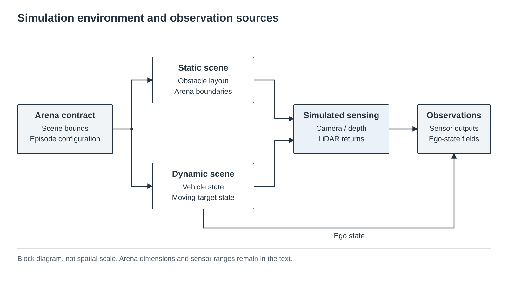
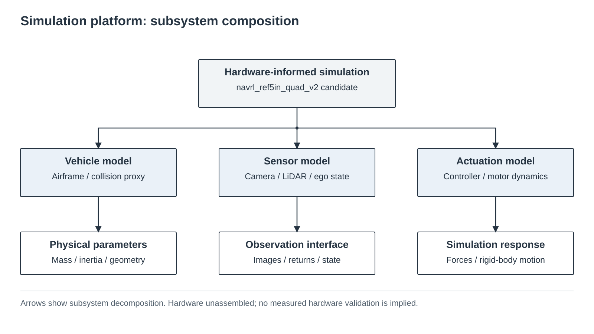
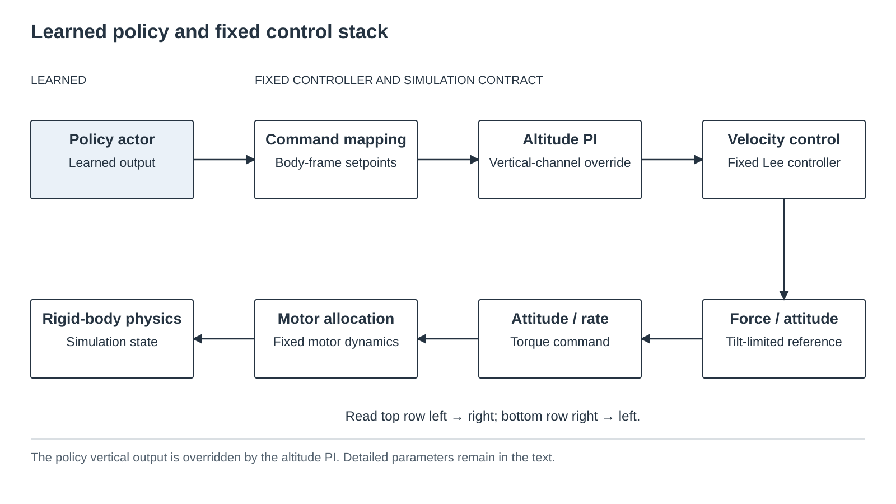
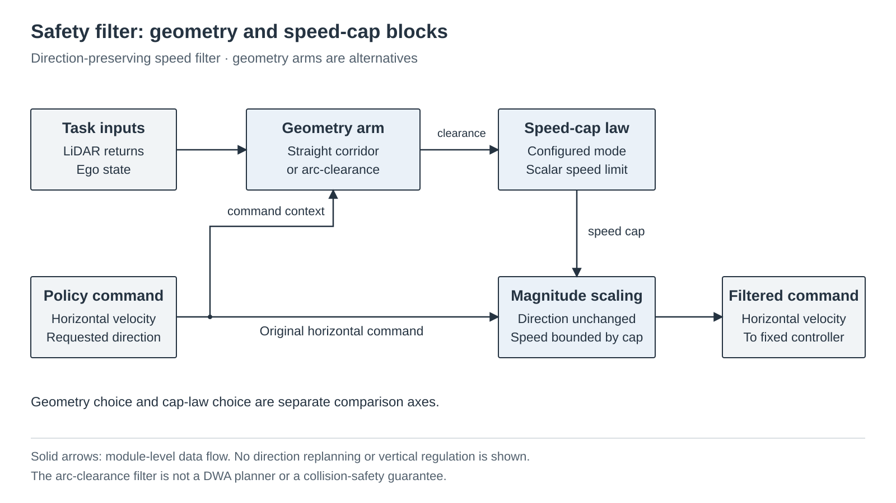
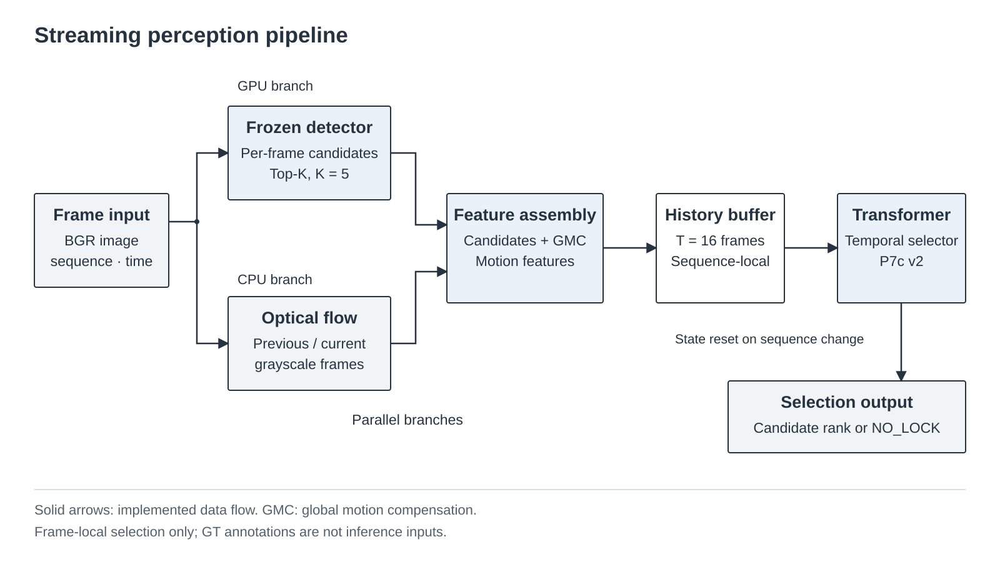
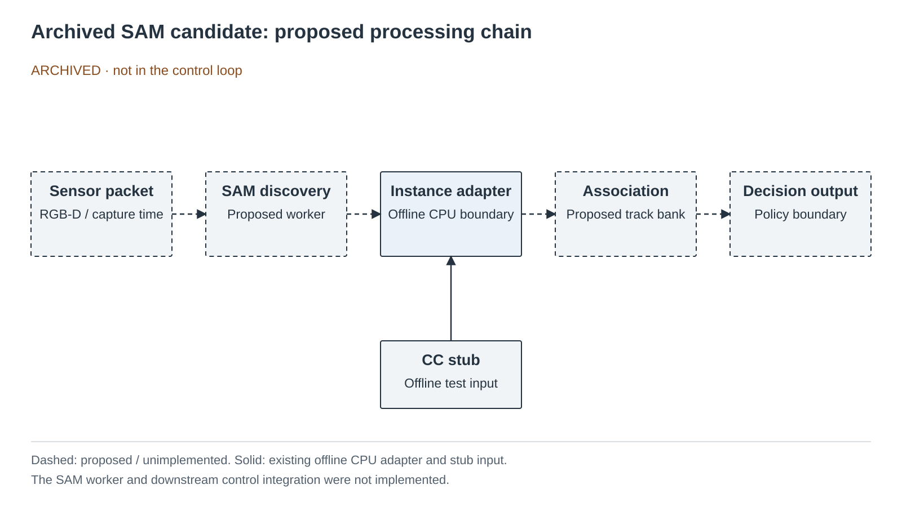
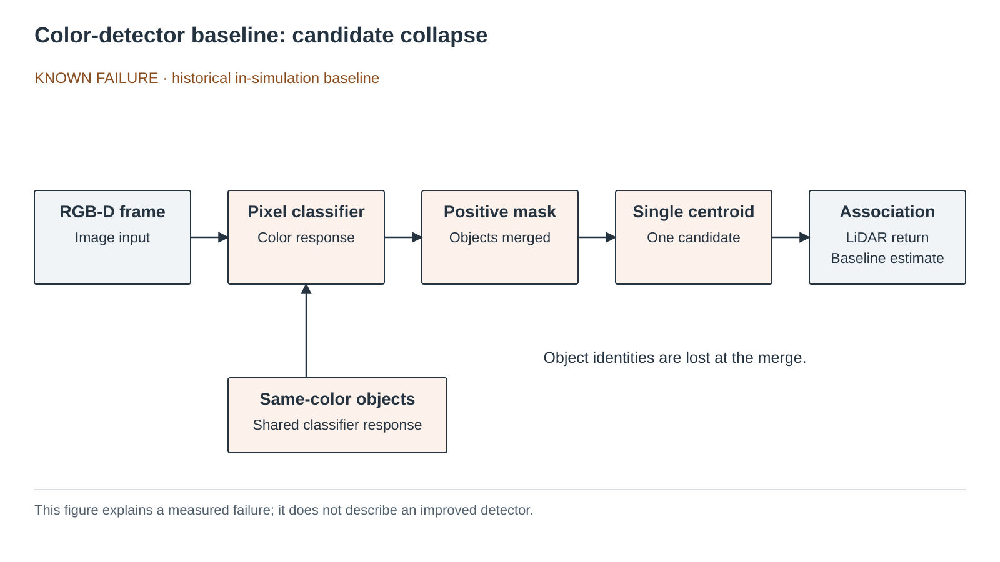
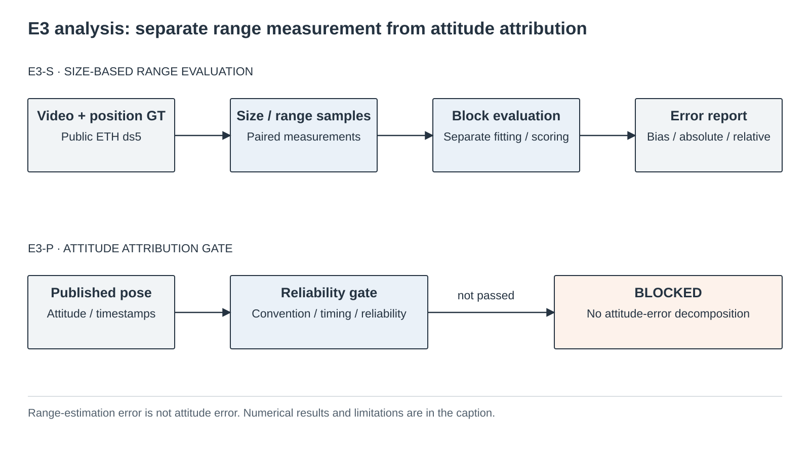

# Results overview — evidence, not an execution plan

The [previous README](archive/readme_9732d12_2026-09-12.md) preserves the full numerical narrative
from source `9732d12`. This summary does not recompute or promote any result. The current authority
is [VERIFICATION](../VERIFICATION.md); dates and failed runs remain in [WORKLOG](../WORKLOG.md).

| Track | Question | Verified result | Negative / withdrawn result | Limitation | Source |
|---|---|---|---|---|---|
| A | What limits the recorded safety-filter findings? | Existing diagnostics and replication completed | C3 explanation WITHDRAWN | No formal safety guarantee | [replication](../results/navrl_grid_r2_d4_trainseed_rep/README.md) |
| B | What was measured in the real-image perception lineage? | P3–P10 and selector evaluation recorded | Readaptation replication INCONCLUSIVE | Dataset/lineage-specific; no deployed identity claim | [P10 replication](../results/perception_p10_seed_replication_2026-09-10/README.md), [S4](../results/perception_s4_2026-09-09/README.md) |
| C | Does image size predict range in the studied flight? | E3-S SIZE_RANGE_USABLE | E3-P ATTITUDE_NOT_RELIABLE, decomposition BLOCKED | One flight; apparent-size proxy, not GT boxes or causal attitude separation | [E3-S](../results/eth_ds5_e3s_2026-09-10/README.md), [E3-P](../results/eth_ds5_e3p_reliability_2026-09-10/README.md) |
| D | What do independent renderer checks establish? | Loader, CPU smoke and background engineering checks | R4/R4b FAIL retained | No shortcut-reduction or detector-integration claim | [reverification](../results/renderer_reverification_2026-09-11_1951/README.md), [CPU install](../results/renderer_cpu_install_2026-09-12/README.md) |

The independent prototype area ratio **0.587** and simulator probe **1.000** over **3,840** stored
count pairs describe different input paths. Identical counts are not identical images or full
trajectories. [Probe audit](../results/target_appearance_in_sim_2026-09-12/AUDIT.md).
The V1 test conflict was reconciled separately; it did not fill missing probe provenance.

## Figure collection

These nine paper-style figures retain their original captions in the
[gallery](assets/paper/). They are component/evidence diagrams, not deployment instructions.

Previous evidence cards: [overview](assets/motar-system-overview.svg),
[control](assets/motar-control-stack.svg), [perception](assets/motar-perception-final.svg),
[E3](assets/motar-eth-e3-evidence.svg), [baseline](assets/motar-perception-detection.svg),
[filter](assets/motar-safety-filter.svg), [archived candidate](assets/motar-perception-candidate.svg).

[Current figure package](assets/paper/motar-paper-block-diagrams.zip) ·
[Archived presentation package](assets/presentation/motar-presentation-2026-09-10.zip).
SAM remains an archived **설계 후보**, with only its documented **offline CPU** implementation:
[historical verification plan](SAM3_PERCEPTION_VERIFICATION_PLAN_2026-09-03.md).
[Historical perception plan](plans/perception_final_implementation_plan_2026-09-07.md).
