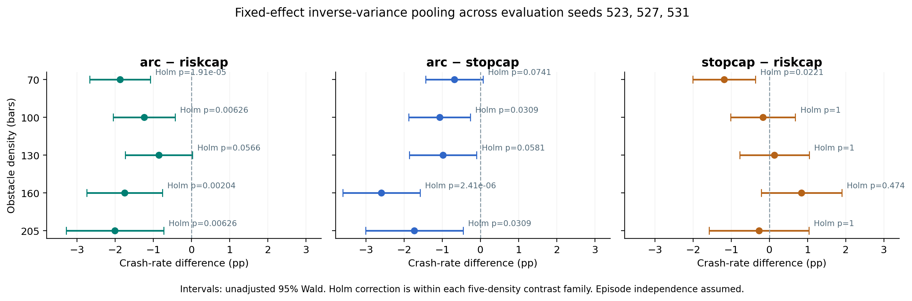
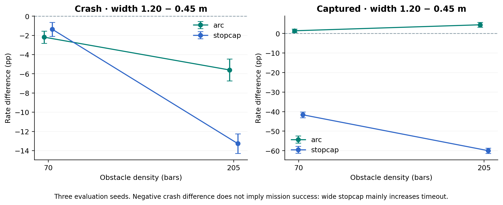

# 독립 검증 보고서 — NavRL 속도 안전필터 136 cell

검증일: 2026-09-07. 검증 대상: `results/verification_export_2026-09-07/`, master plan, confirmation plan. 분석은 신규 `recompute.py`에서 Python 표준 라이브러리로 작성했고 기존 `tools/` 분석기와 제공된 `verify.py`를 import하지 않았다. 마지막에만 제공된 출력과 대조했다. **GPU 시뮬레이션이나 재학습은 실행하지 않았다.** 저장된 원자료의 재계산과 provenance 검증, 보존된 함수의 CPU 반례 검사다.

## 1. 판정

**주효과의 산술은 통과한다. 일반화와 기제의 일부 서술은 통과하지 않는다.** arc−riskcap **−1.4903 pp [−1.8981, −1.0826]**는 재현되며, 새 평가 seed 527/531만으로도 −1.6669 pp [−2.1688, −1.1649]다. 반면 “70 bars 이득은 noise가 아니다”, “100 bars 이상에서는 효과가 사라진다”, “pinch가 드물므로 통과 가능한 경로가 있었다”, “모든 계보·밀도에서 원호가 최선”, “적응 폭은 필요 없다”는 현 증거보다 강하다.

가장 우선할 수정은 다음과 같다.

1. **분석기 선택키 결함**: 제공된 `verify.py`는 adaptive arm을 fixed arm과 같은 키로 묶는다. 원본 순서는 올바른 baseline이 먼저 나와 주효과가 맞지만, 순서를 뒤집으면 −1.5552 pp [−1.9616,−1.1488]로 바뀐다. “중복은 모두 동일”이라는 주석은 틀리다.
2. **P5의 두 층위를 분리**: “모든 CI가 0 포함”이라는 관측 예측은 실패했다. 그러나 그것을 “동등성 기각” 또는 “노이즈 배제”로 바꾸면 안 된다. 에피소드 단위 70 bars Holm p=.0221과 seed 단위 t 검정 p=.1085를 함께 보고한다.
3. **C4의 적용 범위와 C5의 지표 수정**: 주효과는 특정 frozen ep25000 정책의 3 평가 seed에서 지지된다. 넓은 직선 필터도 crash는 줄지만 capture가 붕괴하므로, “폭 효과의 반대 부호”는 capture에 관한 문장으로 쓴다.
4. **R-C를 full training seed replication으로 명명하지 말 것**: 공통 ep1900 checkpoint에서 RNG seed만 바꾸는 재적응 반복이다. 이 계획으로 독립적인 사전학습 계보 3개가 생기지는 않는다.
5. **계획 비용을 arm별로 계산**: wide stopcap 평균 9.85분으로 narrow riskcap 3.73분의 2.64배다. 모든 cell에 같은 5분을 적용하지 않는다.

## 2. 데이터 무결성 및 포함 기준

CSV는 **136행, 58열, 13개 결과 root**이며 기록된 episode 분모의 합은 **278,728**이다. cell당 실제 종료 episode는 **2,049–2,052**다. 이 합은 재실행·중복 조건을 포함한 *기록량*이며 독립적인 278,728 trial이나 독립 seed 수가 아니다. 136/136행에서 crash+captured+timeout=n 및 CSV 비율의 개수 재계산이 일치했다. 로컬의 원본 result JSON 136개를 찾아 CSV의 SHA-256, outcome count, 기록된 조건을 대조했고 불일치는 0건이었다.

**manifest는 13개가 아니라 10개**다. A7의 세 root(`A7_ref5in_s509`, `A7_ref5in_s491`, `A7_ep25000_205_s49`)가 manifest 목록에서 빠져 있다. exporter가 `cells.json`이 있는 root만 manifest에 추가하기 때문이다. 10개 manifest의 `cells.json` 해시는 모두 일치했다. root 요약에는 각 root의 cell 수도 없다. 13-root 명시적 목록, 누락 사유, cell 수, full checkpoint hash와 full source hash를 추가해야 한다.

학습 seed 번호도 계보별로 구분해야 한다. `197`은 ref5in D4/A8의 재적응 seed이며, ep25000의 보존된 학습 런처는 `SEED=1`을 지정한다. 둘을 하나의 “학습 seed197” 결과로 기술하지 않는다. 본 감사는 full-training 독립 반복이 없다는 한계와 frozen checkpoint identity를 기준으로 범위를 제한했다.

주분석은 **45개 평가 cell = 3 evaluation seeds × 5 densities × 3 narrow arms**, 총 **92,227 episode 기록**으로 구성했다. 비교 하나당 15개의 seed×density 대비를 사용했다. seed 523의 narrow arm은 D1′ root, 527/531은 각 R-B root에서 선택했다. 폭 대비의 523 baseline과 1.2 m arm은 모두 L1 root에서 선택했다. 다른 root의 재실행을 새 독립 trial로 추가하지 않았다.

| seed | bars | arc crash/n | riskcap crash/n | stopcap crash/n |
|---|---|---|---|---|
| 523 | 70 | 92/2049 | 117/2050 | 110/2049 |
| 523 | 100 | 95/2049 | 131/2049 | 127/2050 |
| 523 | 130 | 128/2049 | 137/2049 | 155/2049 |
| 523 | 160 | 167/2049 | 185/2049 | 224/2050 |
| 523 | 205 | 306/2049 | 335/2049 | 353/2051 |
| 527 | 70 | 84/2050 | 137/2051 | 103/2051 |
| 527 | 100 | 110/2049 | 128/2049 | 116/2049 |
| 527 | 130 | 128/2049 | 152/2049 | 130/2049 |
| 527 | 160 | 149/2049 | 200/2050 | 205/2049 |
| 527 | 205 | 285/2051 | 346/2050 | 333/2049 |
| 531 | 70 | 96/2050 | 134/2049 | 101/2049 |
| 531 | 100 | 102/2049 | 124/2049 | 130/2050 |
| 531 | 130 | 125/2050 | 145/2051 | 158/2049 |
| 531 | 160 | 160/2050 | 199/2049 | 207/2050 |
| 531 | 205 | 303/2050 | 336/2049 | 315/2049 |


접촉 검증에는 CSV에 포함되지 않은 로컬 JSONL **114개, 19,298행**을 추가로 사용했다. 파일 행 수와 보존된 해시가 모두 일치했다. **따라서 CSV와 manifest만 전달받는 외부 검증자는 C1/C2의 분포나 source diff를 여기와 같은 수준으로 확인할 수 없다.** 원 패키지의 절대 경로를 상대 경로로 바꾸고 JSONL 및 보존 source/receipt 또는 그 다운로드 경로를 묶어야 한다. 아래 접촉·소스 판단은 이 확장 증거에 의존한다.

## 3. 통계 재계산

### 3.1 정의와 추정량

cell i의 종료 episode 수를 nᵢ, crash 수를 cᵢ라 하고 p̂ᵢ=cᵢ/nᵢ로 정의했다. arm A−B의 차이는 Δᵢ=100(p̂_A−p̂_B) pp다. 음수는 A에서 crash 비율이 낮음을 뜻한다. 독립 이항 근사에서

`Vᵢ = 10000[p̂_A(1−p̂_A)/n_A + p̂_B(1−p̂_B)/n_B]`,

`Δ̂_IVW = Σ(Δᵢ/Vᵢ)/Σ(1/Vᵢ)`, `SE = √(1/Σ(1/Vᵢ))`, `95% CI = Δ̂_IVW ± 1.95996398454 SE`로 계산했다. 양측 normal p는 `erfc(|Δ̂/SE|/√2)`다. `Q=Σ(Δᵢ−Δ̂)²/Vᵢ`, `I²=max(0,(Q−df)/Q)`를 병기했다. 밀도별 5개 검정에는 **대비별로 분리한 5-test family**에 Holm 보정을 적용했다. 표의 CI는 보정 전 95% CI이며 Holm-adjusted p와 동일한 구간이 아니다. 이 family는 이번 감사의 명시적 분석 선택이며 원 사전등록에 완전하게 고정된 family였다고 주장하지 않는다.

| 비교 A − B | IVW 차이 [95% CI], pp | 양측 p | Q(df) | I² |
|---|---|---|---|---|
| dwa_arc-riskcap | -1.4903 [-1.8981, -1.0826] | 7.82e-13 | 10.276 (14) | 0.0% |
| dwa_arc-stopcap | -1.2506 [-1.6531, -0.8482] | 1.13e-09 | 16.483 (14) | 15.1% |
| stopcap-riskcap | -0.2260 [-0.6499, +0.1978] | 0.296 | 19.673 (14) | 28.8% |


주효과의 SE는 **0.2080243 pp**, z=−7.1642다. `I²=0%`는 음수 추정량을 0으로 절단한 결과이지 seed 효과가 없다는 증명이 아니다. Q(df=14)는 **seed×density 대비 전체의 분산**을 요약한다. 이를 곧바로 “seed 간 이질성 0”이라고 부르면 분석 단위를 잘못 설명한다. seed별 평균의 between-seed Q는 2.1426(df=2), p=.3426이며, seed가 3개라 이질성 추정의 불확실성이 크다. [Cochrane Handbook, Chapter 10](https://www.cochrane.org/authors/handbooks-and-manuals/handbook/current/chapter-10).

| bars | arc − riskcap, pp | Holm p | arc − stopcap, pp | Holm p | stopcap − riskcap, pp | Holm p |
|---|---|---|---|---|---|---|
| 70 | -1.87 [-2.67, -1.08] | 1.91e-05 | -0.69 [-1.44, +0.07] | 0.0741 | -1.19 [-2.01, -0.37] | 0.0221 |
| 100 | -1.24 [-2.06, -0.43] | 0.00626 | -1.07 [-1.88, -0.26] | 0.0309 | -0.17 [-1.02, +0.68] | 1 |
| 130 | -0.86 [-1.73, +0.02] | 0.0566 | -0.98 [-1.87, -0.10] | 0.0581 | +0.13 [-0.78, +1.04] | 1 |
| 160 | -1.76 [-2.75, -0.77] | 0.00204 | -2.60 [-3.61, -1.59] | 2.41e-06 | +0.84 [-0.21, +1.90] | 0.474 |
| 205 | -2.01 [-3.29, -0.73] | 0.00626 | -1.73 [-3.01, -0.46] | 0.0309 | -0.28 [-1.58, +1.03] | 1 |




### 3.2 평균 이득을 반증하려는 민감도 분석

- **기존 탐색 seed 523 제거**: arc−riskcap −1.6669 [−2.1688,−1.1649] pp. 두 새 seed가 같은 source tree에서 생성되었으므로 교차-tree 결합에 의존하지 않는 평균 이득 근거다.
- **동일 cell 가중치**: −1.5489 [−1.9820,−1.1158] pp. IVW 결과가 저밀도의 작은 분산에만 의존한 부호는 아니다. 다만 IVW는 70/100/130/160/205 bars에 각각 **26.29/25.14/21.52/16.91/10.15%** 가중치를 주므로 균등 density 평균이나 실제 배포 환경의 평균과 동일하지 않다.
- **동일 density 평균을 seed마다 먼저 계산하고 seed 3개에 t(df=2) 구간 적용**: −1.5489 [−2.6482,−0.4496] pp, p=.0261. 보수적 범위 점검에서도 평균 차이는 음수다. 그러나 이는 seed 효과의 정규성을 가정한 소표본 민감도 분석이며 episode-level 군집 bootstrap을 대체하지 않는다.
- **분산 팽창 민감도**: 원래 분산을 D배로 키우는 단순 모델에서는 D≈13.36에서 주효과의 95% CI가 처음 0에 닿는다. 이것은 군집 효과의 추정값이 아니며, 실제 D를 CSV만으로 측정할 수 없다는 점을 드러내는 임계값이다.

동일 RNG seed를 공유하는 arm은 초기 장면을 공유할 수도 있고, 다른 종료 시점 때문에 이후 RNG 소비가 달라질 수도 있다. 따라서 **paired trial로도, 무조건 독립 trial로도 자동 분류할 수 없다.** 레이아웃 ID·env ID·episode ID·종료 outcome의 원장 없이 공분산을 복원할 수 없다. 동일 episode가 아니라는 사실만으로 독립성이 성립하지 않는다. 군집 내 양의 상관은 분산을 키울 수 있고, arm 사이 양의 짝 공분산은 차이의 분산을 줄일 수도 있으므로 오차 방향을 단정하지 않는다.

## 4. P5: 70 bars의 효과를 noise로 설명할 수 있는가

| 평가 seed | 70 bars stopcap − riskcap, pp | 양측 p |
|---|---|---|
| 523 | -0.3388 [-1.7392, +1.0615] | 0.635 |
| 527 | -1.6577 [-3.0933, -0.2222] | 0.0236 |
| 531 | -1.6105 [-3.0334, -0.1877] | 0.0265 |


세 seed의 방향은 모두 음수다. 다만 seed 523의 개별 CI는 0을 포함하고 527/531만 제외한다. 동일 부호 세 번만 보는 정확 부호검정은 **한쪽 방향을 사전에 정했다면 p=1/8=.125**, 양측이면 **p=2/8=.25**다. 이 숫자를 episode 기반 z 검정의 p와 혼동해서는 안 된다.

세 seed를 이항 분산으로 결합하면 **−1.1904 [−2.0099,−0.3710] pp**, raw p=.00441, 5-density Holm p=.02205다. 따라서 **독립 episode 모형과 이 다중비교 family에서는 영효과에 반하는 증거가 남는다.** noise가 “더 좋은 설명”이라고 단정할 근거도 없다. 반면 **seed 단위 평균±t(df=2)**는 **−1.2024 [−3.0610,+0.6563] pp**, p=.10848이고, 단순 분산팽창 D=2.11이면 이항 IVW 구간도 0에 닿는다. 주효과보다 이 국소 차이가 의존성 가정에 훨씬 민감하다.

원문 “각 seed에서 하나씩 0을 제외했다”는 근거에는 또 다른 문제가 있다. seed 523의 이탈은 **160 bars의 +1.898 pp**로 stopcap이 더 나쁜 방향이며, 527/531의 이탈은 70 bars에서 더 좋은 방향이다. 15개 seed×density 검정을 한 family로 Holm 보정하면 **개별 cell은 0/15 통과**한다(최소 adjusted p=.3543). 이것은 5개의 density-pooled test와 다른 검정 가족이다. 두 분석 중 더 편리한 p만 선택하지 말아야 한다. Holm은 family-wise error를 제어하지만 원래 p의 모형 오류를 고치지는 않는다. [R 공식 p.adjust 문서](https://stat.ethz.ch/R-manual/R-devel/library/stats/html/p.adjust.html).

**P5의 논리적 문제**: “95% CI가 모든 밀도에서 0을 포함한다”는 효과의 크기나 동등성 한계가 아니라, 표본에 따라 달라지는 CI 사건을 예측한 것이다. 15개 독립 검정이 모두 실제 영효과라고 가정해도 하나 이상 0을 제외할 확률은 `1−0.95¹⁵=53.67%`다(실제 의존성을 반영한 계산은 아님). 따라서 예측 실패를 그대로 기록할 수는 있어도 “통계적 동등성이 기각됐다”고 표현하면 안 된다.

**“100 bars 이상에서 사라진다”도 정정해야 한다.** 100/130/160/205 bars의 CI는 각각 [−1.02,+0.68], [−0.78,+1.04], [−0.21,+1.90], [−1.58,+1.03] pp다. 이는 0 주변의 넓은 범위와 양립한다. density 효과의 omnibus Q_between=9.8548(df=4), p=.04295이며 탐색적 effect-modification 단서는 있다. 사후 70−고밀도 통합 대비는 −1.3167 [−2.2742,−0.3592] pp, p=.00704이나 “100”이라는 sharp breakpoint의 검증은 아니다. 70−100 직접 대비는 −1.0206 [−2.2005,+0.1593], p=.0900이다.

권장 문장: **“70 bars에서는 stopcap의 crash 비율이 riskcap보다 약 1.19 pp 낮았으며 episode-independent IVW 및 density-wise Holm 보정에서 차이가 남았다. 다른 density의 추가 이득은 검출되지 않았다. 세 평가 seed만을 독립 반복 단위로 처리한 국소 효과 구간은 0을 포함하므로 seed 일반화와 practical equivalence는 확정하지 않았다.”**

무효과나 “거의 같은 성능”을 주장하려면 실용 동등성 한계 ±δ를 실제 운용 비용으로 사전 정의하고 TOST 등의 동등성 검정을 사용해야 한다. `p>.05` 또는 “점추정 ±2 pp 안이고 CI가 0 포함”은 동등성 검정이 아니다. [Lakens의 equivalence testing 논문](https://doi.org/10.1177/1948550617697177).

## 5. 두 source tree를 결합해도 되는가

**1-cell aggregate match만으로는 충분하지 않다. 그러나 이것 때문에 주분석이 자동 무효가 되는 것도 아니다.** 다음 세 층위를 구분한다.

1. **저장 무결성**: old D1′/L1 및 new R-B527/R-B531/cross-tree의 manifest 각각이 선언한 runtime 파일 340개를 스냅샷 바이트와 대조했고 **5×340 검사에서 오류 0**이었다. 이 검사는 해당 시점의 모든 외부 라이브러리·GPU 드라이버까지 포괄하지 않는다.
2. **변경 영향 검토**: D1′와 L1의 runtime 파일은 동일했다. old→new 차이는 5파일: 평가 런처, A8 학습 런처, contact recorder, task, speed governor다. adaptive-width gain이 0이면 이전과 같은 scalar 반폭을 반환하고 새 clutter 계산도 실행하지 않는다. 기록된 R-B 조건에서 adaptive/lateral/yaw 추가 기능은 꺼져 있었다. I4 추가는 주로 접촉 기록 경로다. pip manifest 차이는 확인한 old/new 쌍에서는 editable repository commit 줄뿐이었다. 이는 기본 제어 경로 보존을 지지하지만 host-side 기록 부하와 GPU 스케줄의 영향까지 증명하지는 않는다.
3. **재실행의 범위**: seed523·205bars·arc 0.45 m 한 cell에서 crash/capture/timeout=**306/1699/44**, n=2049가 일치했다. 이것은 outcome aggregate equality다. episode 순서·state/action tensor·RNG 상태나 모든 arm의 일치가 검증된 것은 아니다. manifest 자체도 시각·commit·추가 계측 때문에 다르다. 따라서 “비트 동일”은 비교한 항목을 한정해 써야 한다.

저장된 raw JSON SHA와 counts만으로 “13쌍 중 12쌍”의 실험 단위를 자동 재구성할 수도 없다. 같은 baseline을 여러 번 비교하면 pair 수는 독립 검증 수보다 커진다. pair ID·양쪽 root·full 조건·비교 필드·일치 결과를 담은 전용 표를 추가해야 한다. A8 T1/riskcap의 **358/2050 대 343/2049** 차이는 후속 두 번이 343/2049였다는 이유만으로 원인이 해결되지 않는다. R-A는 3개 반복의 집계 안정성을 지지하며 전역 결정성의 증명은 아니다.

권장 우선순위는 **새 tree의 두 seed만인 결과를 별도로 제시**하고, 이어서 **고정 tree에서 seed523의 15 narrow cell을 모두 생성**하는 것이다. 이미 실행한 한 cell을 그대로 인정한다면 추가 14cell이다. 폭까지 단일-tree 비교로 만들려면 70/205×2 widened arm의 4cell을 더해 18개를 실행한다. 결과를 보기 전에 일치/불일치 처리 규칙과 새 primary set을 동결한다. old/new를 임의로 섞어 더 유리한 셀만 취하지 않는다.

### 추가 반례: “원호 swept tube를 정확히 검사한다”는 해석

보존된 `speed_governor.py`를 CPU에서 직접 실행했다. 명령 `(2,0) m/s`, 측정 yaw-rate `1 rad/s`이면 R=2 m다. 반폭 0.45 m 튜브와 `(0.5,0) m`의 유효 수평 return에 대해 원호까지의 오프셋은 `sqrt(0.5²+2²)−2=0.061553 m`로 튜브 안이다. 그러나 구현의 `along=2|R||bearing|=0`과 `along>0` 조건 때문에 해당 return을 버려 clearance=**12 m**를 반환한다. 같은 입력의 직선 함수는 **0.5 m**를 반환한다.

원호 중심선의 진행거리 0.1 m 위치는 `(0.099958,0.002499)`이고 이 점과 return의 거리는 **0.400049 m < 0.45 m**다. 즉 swept disk는 처음 거리 0.5 m인 이 장애물과 곧 겹친다. 이것은 **튜브 내부의 모든 장애물을 보장 검출한다는 명제의 반례**다. 단일 센서 입력의 unit-level 검사이며 실제 136cell에서 발생 빈도나 crash 기여율을 추정한 것은 아니다. 현 알고리즘을 full DWA planner나 exact collision checker로 명명하지 말고 “현재 구현한 arc-clearance speed filter”로 써야 한다. 구현 수정을 한다면 새 버전으로 별도 평가해야 하며, 현 결과의 숫자를 수정 버전 성능처럼 재사용할 수 없다.

## 6. 주장 표 C1–C6/N1/N2 감사

사용자가 지칭한 “§2의 C1–C6 표”는 현재 파일에서는 **§1**에 있다. §2는 정정 이력 표다. 두 표를 모두 검토했다.

| 행 | 판정: 어디가 잘못됐는가 | 왜 문제인가 / 수정할 문장 |
|---|---|---|
| C1 | 일반 범위 0.57–0.76 m는 반증됨 | 114 contact 파일의 cell 중앙값은 0.28225–0.88530 m. D1′의 narrow arm만 보아도 0.54910, 0.82850 m가 존재. 조건별 n·중앙값·IQR로 교체. 장애물 중심의 명령축 오프셋은 실제 LiDAR 표면 return의 회랑 포함 여부와 같지 않음. |
| C2 | 기술통계는 재현; “틈이 아니라 경로 이탈”의 배타적 인과는 미입증 | pinch는 body-frame 좌우 15°–165° 섹터에서 외접원 표면거리 둘 다 <0.65 m인지 검사한다. 앞뒤 장애물·회전 swept volume·제동 가능 경로를 검사하지 않는다. “이 정의의 동시 양측 협착은 97/5890=1.647%”로 제한. |
| C3 | D4의 상호작용은 지지; 일반 법칙 결정론 및 고밀도 소멸 주장은 과도 | D4 interaction +4.335 pp [1.223,7.448], p=.00633. 한 공통 ep1900 checkpoint에서 한 재적응 seed의 결과다. R-B는 다른 ep25000 정책·v2 기체·6–28 m 조건이므로 D4의 density interaction을 직접 검증하지 않는다. |
| C4 | ep25000의 평가 seed 523/527/531 범위에서는 지지 | 원호의 crash와 개입률은 15/15에서 두 narrow 직선 arm보다 낮다. 그러나 arc−stopcap 70 bars CI는 0 포함, Holm 후 130 bars도 제외 못 함. A7 seed49·205 bars에서는 arc−stopcap +0.439 pp로 반대 부호. “계보와 밀도를 넘어 최선/유일” 삭제. |
| C5 | 원호 1.2 m의 joint outcome 이득은 지지; 폭에 대한 crash 부호반전 표현은 틀림 | 폭 증가시 직선도 crash는 감소한다(205 bars −13.27 pp). 반대가 되는 것은 capture: 원호 +4.44 대 직선 −59.98 pp. 원호도 timeout +1.14 pp. 8점은 원호에만 해당하며 직선은 5점; 완전한 8×2×2 격자가 아님. |
| C6 | 끝점 차이는 지지; 단조 증가·2 seed 증거 범위는 제한 | riskcap−off는 70/100/130/160/205 bars에서 −4.00/−2.09/−3.70/−6.30/−8.78 pp로 단조 아님. 205−70 interaction −4.78 pp [−7.74,−1.82]. 인용된 seed53 데이터는 이번 136행에 없으므로 2-seed 확인은 별도 증거 필요. |
| N1 | 큰 직선 폭의 과잉 감속과 임무 실패는 지지; 독립적인 측면 채널의 해법은 미시험 | 고정 stopcap 1.2 m는 capture 70 bars 48.85–49.44%, 205 bars 9.71–10.64%. “측면만 넓히면 해결”은 L3 A/B 전 가설. crash만 평가하면 이 실패를 개선으로 오판한다. |
| N2 | 첫 adaptive rule의 실패는 지지; “적응은 필요 없다”는 미입증 | 수정본 미실행, 고정 폭도 같은 탐색 데이터에서 선택됨. 70 bars에서 1.6 m는 최저 1.2 m보다 0.342 pp 높아 엄밀한 0.3 pp 문구도 틀림. “시험한 고정 폭이 시험한 adaptive rule보다 우수”로 한정. |


### 6.1 접촉 기하의 재현값과 한계

R-B seed527/531의 50cell에서는 접촉 5890건, pinch 97건(1.647%)을 재현했다. narrow 세 arm만 묶으면 66/4629=1.426%다. 아래 모든 분포는 **접촉을 조건으로 선택한 표본**이다.

| arm | 반폭 m | 협착/접촉 | 협착률 | 측면 오프셋 중앙값 [IQR], m | 큰 쪽 섹터 여유 중앙값, m |
|---|---|---|---|---|---|
| riskcap | 0.45 | 30/1686 | 1.779% | 0.7319 [0.4039, 1.0803] | 1.9317 |
| stopcap | 0.45 | 15/1610 | 0.932% | 0.5907 [0.3053, 0.9207] | 1.8707 |
| dwa_arc | 0.45 | 21/1333 | 1.575% | 0.6911 [0.3613, 1.0967] | 1.7720 |
| dwa_arc | 1.2 | 31/763 | 4.063% | 0.7046 [0.5063, 0.9589] | 1.5145 |
| stopcap | 1.2 | 0/498 | 0.000% | 0.5099 [0.2702, 0.6800] | 2.3752 |


`gap_left_t0/right_t0`는 장애물 XY 중심거리에서 막대 XY 반대각선(외접원 반경)을 뺀 근사 표면거리다. 좌/우 sector가 비어 있으면 12 m를 기록한다. 이 값은 raycasting으로 확인한 통로 폭이나 collision-free reachable set이 아니다. `max(left,right)`도 “충돌한 막대의 반대편”으로 정의된 값이 아니라 단순히 두 sector 중 큰 값이다. 4.063%와 문턱20%는 **4.92배 차이**이며 “한 자릿수(order of magnitude) 낮다”는 표현도 정확하지 않다.

높은 yaw/slip는 사례 간 연관성이다. 속도·density·노출시간·필터 선택이 다르고 non-contact denominator와 episode-level 공분산이 없으므로 경로 이탈의 인과 효과를 식별하지 못한다. “통로 협착이 유일한 원인”에는 반하는 증거지만 “협착이 아니다”라는 배타적 결론으로 바꾸지 않는다.

### 6.2 폭 효과는 crash와 capture를 함께 보고해야 한다

| bars | 기하/법칙 | Δcrash, pp | Δcapture, pp | Δtimeout, pp |
|---|---|---|---|---|
| 70 | dwa_arc | -2.18 [-2.81, -1.55] | +1.39 [+0.54, +2.23] | +0.79 [+0.21, +1.37] |
| 70 | stopcap | -1.37 [-2.09, -0.64] | -41.62 [-43.06, -40.17] | +42.99 [+41.64, +44.33] |
| 205 | dwa_arc | -5.60 [-6.73, -4.47] | +4.44 [+3.19, +5.70] | +1.14 [+0.53, +1.76] |
| 205 | stopcap | -13.27 [-14.28, -12.25] | -59.98 [-61.35, -58.61] | +73.26 [+72.06, +74.47] |




205 bars의 wide stopcap은 crash **−13.27 pp**와 동시에 capture **−59.98 pp**, timeout **+73.26 pp**다. 따라서 낮은 crash 비율 하나를 safety+mission 개선으로 해석할 수 없다. 원호 확대는 같은 density에서 crash −5.60 pp, capture +4.44 pp지만 timeout도 +1.14 pp 증가한다. 각 metric의 IVW 가중치를 별도로 계산했으므로 세 pooled 차이의 합이 정확히 0일 필요는 없다. 개별 cell의 outcome 비율 합은 1이다.

## 7. 계획서의 근거 약한 수치 및 수정

### 7.1 실제 실행시간

R-B 50개 receipt의 `completed_at_utc−started_at_utc`를 다시 계산했다. 합 **259.75분(4.329 h)**, 평균 **5.195분**, 중앙값 **4.141분**, 범위 **3.067–11.273분**이다. 두 root 각각의 첫 시작–마지막 종료 span은 **130.778분 / 130.253분**, 합261.03분이다. 4h18min과 큰 운영상 차이는 아니지만, 이를 4.5–5.1min이라는 cell 최소–최대로 설명할 수 없다. wall-time이지 순수 GPU kernel-time은 아니다.

| arm | 반폭 m | cell 수 | 평균 분 | 중앙값 분 | 최소–최대 분 |
|---|---|---|---|---|---|
| riskcap | 0.45 | 10 | 3.73 | 3.67 | 3.07–4.60 |
| stopcap | 0.45 | 10 | 4.57 | 4.36 | 3.40–6.00 |
| dwa_arc | 0.45 | 10 | 3.79 | 3.71 | 3.08–4.66 |
| dwa_arc | 1.2 | 10 | 4.04 | 3.97 | 3.22–5.03 |
| stopcap | 1.2 | 10 | 9.85 | 10.13 | 7.92–11.27 |


D4 4cell의 receipt 평균은 **5.331분**(4.79–5.96분)이므로 R-C 8cell은 동등 하드웨어·조건에서 중심 추정 **42.65분**이다. 계획의 40–50분은 이 범위에서는 합리적이다. A8 학습0.80/0.81/0.81h는 계획/운영 문서가 보고한 값으로 구별했다. 이번 검증 패키지에는 그 학습시간 원장이 포함되어 있지 않으므로 GPU 학습시간 자체를 여기서 독립적으로 재측정했다고 쓰지 않는다.

### 7.2 임의 수치·논리 오류

| 계획 항목 | 문제 | 수정 |
|---|---|---|
| “모든 기간은 측정 비용”, 반나절·2일·검증1일 | 문서 작성·관련 연구·검증에는 반복측정 시간 원장이 없다 | GPU wall-time, 사람 작업시간, 외부 대기를 분리. 사람 시간은 경험적 예산 범위로 표시 |
| “마지막 실험 R-C”, D+5–7 제출 가능 | 군집 원장, source migration, 원호 반례 등 확인 결과에 따라 실험 추가 가능 | 주장 동결과 무결성 gate를 먼저 배치; 제출일은 결과 조건부 범위 |
| R-C 통과: T0 CI0 제외, T1 CI0 포함 | 차이의 차이를 검사하라는 §4 규칙과 모순. CI0 포함은 equivalence 아님 | 각 재적응 seed의 2×2 interaction을 primary로; practical-equivalence margin은 별도 사전 정의 |
| R-C 이후 “학습 seed3” | 모든 arm이 동일 ep1900 checkpoint에서 시작 | “공통 pretrained checkpoint에서 재적응 RNG seed3”로 표기. fresh full-training replication과 구분 |
| R-D 각6cell, 다른 문서에서는8+4 | factorial 수와 기준 arm 정의가 일치하지 않음 | 이름·density·arm·폭·seed가 있는 명시적 cell 목록으로 예산 계산; matched baseline 포함 여부 명시 |
| Det-Fly download1h | 실측 bandwidth·링크·실패율 없음 | 시간 예약치로만 표시. 9.34GB를 10/50/100Mbps로 연속 수신하는 이상적 전송시간 약2.08/.42/.21h; 다운로드 가능 여부와 해제·타일 저장공간 별도 |
| Det-Fly AP ≥0.33이면 “촬영조건을 외운 게 아니다” | 0.549×60% 문턱에 과업·통계 근거 없음. 데이터 난이도와 AP denominator가 다름 | 다른 촬영조건에서의 성능을 수치로 보고하되 암기 부재 증명 금지. sequence bootstrap CI, size/배경별 recall, false alarms/image를 사용 |
| 13–15epoch면 충분 | 한 40epoch 경로의 사후 최적 checkpoint | 새 데이터/합동학습의 convergence 보장 아님. validation early stopping은 선택 규칙으로 동결하고 독립 test set은 한번만 사용 |
| 0.549±0.015가 모델의 “실제 수준” | 인접 epoch는 같은 학습과 같은 validation set이라 강하게 상관. epoch SD는 seed/test uncertainty가 아님 | “epoch12–40의 validation AP 평균/SD”로만 쓰고 generalization CI와 구분 |
| NPS/Det-Fly box 중심으로 방위각 오차 즉시 측정 | pixel 위치차만으로 rad/deg 변환 불가; intrinsics·왜곡·crop/resize 역변환 필요 | calibration이 없으면 pixel/angular proxy로 명명. bounding-box 중심도 실제 3D target bearing GT와 동일하지 않음 |
| 알려진 기체 크기로 거리오차 대리 측정 | 크기·자세·focal length 오차가 미분리. range GT 없이 range error distribution 식별 불가 | 가정 기반 sensitivity model로만 사용; “측정된 실제 거리오차”라고 쓰지 않음 |
| MIDGARD 회신1–3주 | 상대 응답에 대한 관측 분포 없음 | 외부 대기 “기한 미정”. 1주/3주에 내부 follow-up 여부를 결정하는 일정으로 표현 |
| B3 GPU1–3일 | 제시된1회 budget는2.5h+2h≈4.5h; run/seed 수 미정 | `총시간=학습 run 수×epoch×초/epoch + 평가 cell 수×분/cell`로 작성. ep25000와 ref5in 비용의 동일성도 파일럿에서 검증 |

## 8. 후속 실행 계획: 조건부 시간 예산

아래 사람 시간은 **측정 CI가 아닌 계획 범위**다. 한 GPU 순차 실행, 같은 평가 하드웨어, queue·실패 재실행 제외를 가정한다. 현재 요청은 감사와 계획 수립이므로 아래 새 학습·평가는 실행하지 않았다.

| 우선순위 | 작업·완료 기준 | 추가 GPU wall-time | 사람 작업시간(예산) |
|---|---|---:|---:|
| 0 | 13-root manifest, 선택키·중복검사, relative path, 주장 범위 정정; 숫자 provenance 표 고정 | 0h | 2–4h |
| 1 | 136cell에서 episode-level outcome/scene ID 존재 여부 확인; paired/cluster 분석 단위 확정 | 0h | 3–6h |
| 2 | 새 고정 tree에서 seed523 narrow15cell 재확인(기실행1 인정시14개); old/new outcome 및 trajectory hash 대조 | 중심0.93h, 예약1.0–1.5h | 1–2h |
| 2b | 70/205의 widened 두 arm을 추가해 폭 대비도 단일 tree로 구성(4cell) | 중심0.46h, 예약0.5–0.8h | 0.5–1h |
| 3 | R-C: 공통 ep1900에서 2seed×2training arms 재적응, 8 matched eval cell; interaction primary | 3.20–3.24h 학습 + 약0.71h 평가, 예약4–5h | 2–4h |
| 4 | 기존 원호 경계 반례의 정확 geometry oracle 작성·독립 센서 replay; 빈도 및 차이 문서화 | GPU 불필요한 CPU 단계부터 | 4–8h |
| 5 | 결과표·그림·Method/Experiment·한계·관련 연구 대조 및 최종 검증 | 0h | 8–14h |

**조건부 최소 경로**: 위0–5를 선택하면 추가 GPU **약5.5–7.3h**, 사람 **약20.5–39h**다. 이는 full training seed 일반화도, 군집 의존성의 자동 해결도 보장하지 않는다. 계산은 사람이 다음 작업을 하는 동안 순차 실행할 수 있어 두 시간을 단순 합한 calendar duration은 아니다. 하루5시간의 집중 작업을 명시적으로 가정하면 **4–8작업일**, 외부응답·자료유실·반례 수정 재평가 제외다. “D+7 제출 보장”으로 사용하지 않는다.

**episode 원장이 없으면** 가장 먼저 새 기록 방식을 동결한다. 3seed×5density×3arm=45cell 전체를 cluster ID와 함께 새로 수집하는 비용은 이번 narrow arm 실측으로 **약3.02h**다. 이 경우 위14cell migration을 같은 단일-tree 재평가에 포함시켜 이중 계산하지 않는다. 로깅 구현·검증 예산은 **추가4–8h**이며, 한 row마다 scene/layout ID, seed, env ID, episode index, initial-condition hash, arm, 종료원인, 종료시각을 포함한다. layout→episode 계층을 보존하는 resampling을 사용하고 공유 시나리오를 실제로 짝지었을 때만 paired 분석을 한다.

**P5를 별도 확인하려면** post-hoc 저밀도 발견을 새로운 사전등록으로 전환한다. 예를 들어 새 평가 seed3개(예:541/547/557) × 70/160bars × riskcap/stopcap=12cell은 중심 **약0.83h**다. 각 density를 동등하게 배정하고 interaction 및 ±δ equivalence를 미리 정의한다. 3개 추가 seed가 항상 충분하다는 뜻은 아니다. 독립 이항, baseline≈6%, 차이1.2pp, 양측α=.05, power80%의 단순 근사 필요량은 **arm당 약6.1천 episode**이며 Holm/cluster 효과는 이를 늘린다. 관측된 seed SD를 이용한 독립 seed 수 power 설계가 별도로 필요하다. 무제한 seed 추가나 유의해질 때까지 실행은 하지 않는다.

**원호 수정본의 성능을 주장하려면** 원 버전과 분리해 동결한다. original arc / corrected arc / straight stopcap × 3seed × 5density =45cell은 비용 중심 **약3h**이나 수정본 runtime은 미측정이다. 기존 old/new tree source 비교는 같은 알고리즘의 provenance 확인이고, 이 수정본 비교는 새로운 알고리즘 실험이라는 차이를 유지한다.

**Track B**는 계측 목표를 좁혀 시작한다. 데이터 수령 후 ingestion·sequence split·full-frame sliding-window 평가·size bins 검증에 사람6–10h, inference 예산1–3 GPU h(미측정); calibration/각도·누락·false-positive·latency 분석에 사람6–12h, CPU/GPU benchmark 추가. range GT가 없으면 거리오차 추정 일정은 완료일 미정이다. 데이터량이 늘어난 합동학습15epoch를 현재 데이터의40분 비용으로 고정하지 않는다. 투입할 episode noise는 독립 Gaussian 한 가지로 축약하지 말고 거리/크기/가림/연속누락/latency와 false association의 조건부·시간적 상관을 유지해야 한다.

## 9. 재현 및 산출물

```bash
python3 results/independent_verification_2026-09-07/recompute.py
python3 results/independent_verification_2026-09-07/evidence_audit.py
# Optional plotting; requires matplotlib, does not change the statistics.
python results/independent_verification_2026-09-07/plot_audit.py
```

- [논문용 Method / Experiment 초안](PAPER_METHOD_EXPERIMENT.md)
- [재계산 전체 수치](recomputed.json), [주분석 45cell 원계수](primary_cells.csv)
- [소스·실행시간·원호 반례](evidence_audit.json), `source_diff_*.patch`
- [밀도 대비 PDF](figure_density_contrasts.pdf), [폭 trade-off PDF](figure_width_tradeoff.pdf)

검증한 수학 함수는 별도의 SciPy normal/chi-square/t 분포 계산과 1e−12 이내로 일치했다. 원본 CSV, manifest, 계획서, 현행 runtime 코드는 수정하지 않았다. 유실 checkpoint가 걸린 별도 held-out 6결과는 재실행하지 않았으며 본 주분석45cell에 포함되지 않는다. 데이터의 바이트 일치와 산술 재현성은 시뮬레이터가 현실을 정확히 모델링한다거나 실험설계의 인과 식별이 충분하다는 보증이 아니다.
